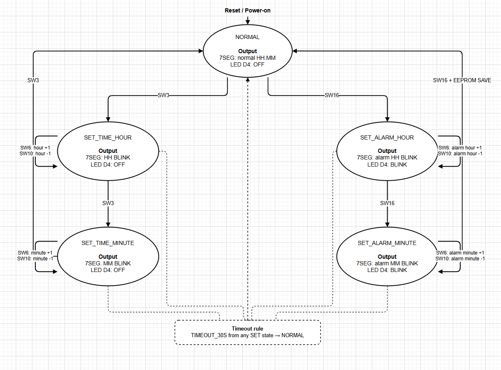

# Application FSM Specification

## 1. Purpose

This document defines the Finite State Machine (FSM) for the MCU digital clock application.

The FSM is derived from the official MCU preliminary-round requirements and is used as the design reference for:

- Application state management
- Clock setting flow
- Alarm setting flow
- 7-segment display behavior
- LED D4 behavior
- Buzzer behavior
- 30-second timeout handling
- EEPROM save trigger
- FSM implementation and verification

Main development flow:

```text
Requirement
    ↓
FSM Specification
    ↓
fsm.h / fsm.c
    ↓
fsm_test.c
    ↓
Keil Simulator Verification
```

---

## 2. FSM States

| State | Meaning |
|---|---|
| `NORMAL` | Normal clock display mode |
| `SET_TIME_HOUR` | Set current clock hour |
| `SET_TIME_MINUTE` | Set current clock minute |
| `SET_ALARM_HOUR` | Set alarm hour |
| `SET_ALARM_MINUTE` | Set alarm minute |

---

## 3. Detailed FSM State Transition Table

| Current State | Event | Next State | Action / Data | 7SEG Display | LED D4 | Buzzer |
|---|---|---|---|---|---|---|
| `NORMAL` | `SW3` | `SET_TIME_HOUR` | Enter current-hour setting mode | Current **HH** blinks: 0.5s ON / 0.5s OFF. **MM** remains visible | OFF | Pip 0.3s |
| `SET_TIME_HOUR` | `SW3` | `SET_TIME_MINUTE` | Enter current-minute setting mode | Current **MM** blinks: 0.5s ON / 0.5s OFF. **HH** remains visible | OFF | Pip 0.3s |
| `SET_TIME_MINUTE` | `SW3` | `NORMAL` | Exit current-time setting mode | Normal `HH.MM` display | OFF | Pip 0.3s |
| `NORMAL` | `SW16` | `SET_ALARM_HOUR` | Enter alarm-hour setting mode | Alarm **HH** blinks: 0.5s ON / 0.5s OFF. Alarm **MM** remains visible | Blink: 0.5s ON / 0.5s OFF | Pip 0.3s |
| `SET_ALARM_HOUR` | `SW16` | `SET_ALARM_MINUTE` | Enter alarm-minute setting mode | Alarm **MM** blinks: 0.5s ON / 0.5s OFF. Alarm **HH** remains visible | Blink: 0.5s ON / 0.5s OFF | Pip 0.3s |
| `SET_ALARM_MINUTE` | `SW16` | `NORMAL` | Save alarm hour/minute to EEPROM; alarm second = 0 | Return to normal `HH.MM` display | OFF | Pip 0.3s |
| `SET_TIME_HOUR` | `SW6` | `SET_TIME_HOUR` | Current hour +1; wrap `23 → 00` | Updated **HH** continues blinking | OFF | Pip 0.3s |
| `SET_TIME_HOUR` | `SW10` | `SET_TIME_HOUR` | Current hour -1; wrap `00 → 23` | Updated **HH** continues blinking | OFF | Pip 0.3s |
| `SET_TIME_MINUTE` | `SW6` | `SET_TIME_MINUTE` | Current minute +1; wrap `59 → 00` | Updated **MM** continues blinking | OFF | Pip 0.3s |
| `SET_TIME_MINUTE` | `SW10` | `SET_TIME_MINUTE` | Current minute -1; wrap `00 → 59` | Updated **MM** continues blinking | OFF | Pip 0.3s |
| `SET_ALARM_HOUR` | `SW6` | `SET_ALARM_HOUR` | Alarm hour +1; wrap `23 → 00` | Updated alarm **HH** continues blinking | Blink: 0.5s ON / 0.5s OFF | Pip 0.3s |
| `SET_ALARM_HOUR` | `SW10` | `SET_ALARM_HOUR` | Alarm hour -1; wrap `00 → 23` | Updated alarm **HH** continues blinking | Blink: 0.5s ON / 0.5s OFF | Pip 0.3s |
| `SET_ALARM_MINUTE` | `SW6` | `SET_ALARM_MINUTE` | Alarm minute +1; wrap `59 → 00` | Updated alarm **MM** continues blinking | Blink: 0.5s ON / 0.5s OFF | Pip 0.3s |
| `SET_ALARM_MINUTE` | `SW10` | `SET_ALARM_MINUTE` | Alarm minute -1; wrap `00 → 59` | Updated alarm **MM** continues blinking | Blink: 0.5s ON / 0.5s OFF | Pip 0.3s |
| `SET_TIME_HOUR` | `TIMEOUT_30S` | `NORMAL` | Exit setting mode | Normal `HH.MM` display | OFF | Pip 0.3s |
| `SET_TIME_MINUTE` | `TIMEOUT_30S` | `NORMAL` | Exit setting mode | Normal `HH.MM` display | OFF | Pip 0.3s |
| `SET_ALARM_HOUR` | `TIMEOUT_30S` | `NORMAL` | Exit alarm setting mode | Return to normal `HH.MM` display | OFF | Pip 0.3s |
| `SET_ALARM_MINUTE` | `TIMEOUT_30S` | `NORMAL` | Exit alarm setting mode | Return to normal `HH.MM` display | OFF | Pip 0.3s |

---

## 4. State Output Behavior

### `NORMAL`

- **7SEG:** normal `HH.MM`
- **LED D4:** OFF

### `SET_TIME_HOUR`

- **7SEG:** HH blinks 0.5s ON / 0.5s OFF
- **7SEG:** MM remains continuously visible
- **LED D4:** OFF

### `SET_TIME_MINUTE`

- **7SEG:** HH remains continuously visible
- **7SEG:** MM blinks 0.5s ON / 0.5s OFF
- **LED D4:** OFF

### `SET_ALARM_HOUR`

- **7SEG:** alarm HH blinks 0.5s ON / 0.5s OFF
- **7SEG:** alarm MM remains continuously visible
- **LED D4:** blinks 0.5s ON / 0.5s OFF

### `SET_ALARM_MINUTE`

- **7SEG:** alarm HH remains continuously visible
- **7SEG:** alarm MM blinks 0.5s ON / 0.5s OFF
- **LED D4:** blinks 0.5s ON / 0.5s OFF

---

## 5. FSM State Diagram

The MCU application uses **one FSM with five states**.



### Self-loop adjustment events

In the four setting states, `SW6` and `SW10` modify the selected value but **do not change the current FSM state**:

```text
SET_TIME_HOUR
    ↻ SW6 / SW10

SET_TIME_MINUTE
    ↻ SW6 / SW10

SET_ALARM_HOUR
    ↻ SW6 / SW10

SET_ALARM_MINUTE
    ↻ SW6 / SW10
```

### Timeout return path

A 30-second period without a button event returns any setting state to `NORMAL`:

```text
SET_TIME_HOUR ──────┐
SET_TIME_MINUTE ────┤
SET_ALARM_HOUR ─────┼── TIMEOUT_30S ──→ NORMAL
SET_ALARM_MINUTE ───┘
```


---

## 6. Adjustment Actions

### Current Clock

```text
SET_TIME_HOUR + SW6
→ Clock_IncrementHour()

SET_TIME_HOUR + SW10
→ Clock_DecrementHour()

SET_TIME_MINUTE + SW6
→ Clock_IncrementMinute()

SET_TIME_MINUTE + SW10
→ Clock_DecrementMinute()
```

Clock rollover behavior:

```text
23 + 1 → 00
00 - 1 → 23

59 + 1 → 00
00 - 1 → 59
```

---

## 7. Timeout Behavior

The following states use a 30-second inactivity timeout:

- `SET_TIME_HOUR`
- `SET_TIME_MINUTE`
- `SET_ALARM_HOUR`
- `SET_ALARM_MINUTE`

```text
Any SET state
     │
     │ 30 seconds without button event
     ▼
   NORMAL
```

Timeout exit behavior:

| Output | Behavior |
|---|---|
| State | `NORMAL` |
| 7SEG | Normal `HH.MM` |
| LED D4 | OFF |
| Buzzer | Pip 0.3s |

---

## 8. Button Buzzer Behavior

Every press of `SW3`, `SW6`, `SW10`, or `SW16` generates a 0.3-second buzzer pip.

This button beep is independent from the state transition logic.

---

## 9. Alarm Trigger Behavior

When the current clock reaches the stored alarm time, the buzzer operates for 5 seconds:

```text
0.5s ON
0.5s OFF
0.5s ON
0.5s OFF
...
Total duration: 5s
```

This behavior belongs to Alarm/Buzzer logic and does not add another setting state to this FSM.

---

## 10. EEPROM Behavior

EEPROM stores:

- Alarm hour
- Alarm minute
- Alarm second = 0

Save trigger:

```text
SET_ALARM_MINUTE + SW16
→ Save alarm to EEPROM
→ Return to NORMAL
```

---

## 11. Unspecified Requirement Cases

The official requirement does not explicitly define functional actions for:

- `NORMAL + SW6`
- `NORMAL + SW10`
- `SET_TIME_HOUR + SW16`
- `SET_TIME_MINUTE + SW16`
- `SET_ALARM_HOUR + SW3`
- `SET_ALARM_MINUTE + SW3`

Current team design rule:

- No state transition
- No clock/alarm value modification
- Button beep still occurs

> Note: the no-transition/no-modification behavior is a team design decision for unspecified combinations.

---

## 12. Requirement Ambiguity

When entering:

```text
NORMAL
  │
  │ SW16
  ▼
SET_ALARM_HOUR
```

the requirement clearly specifies entering alarm-hour setting mode and blinking the HH digits.

However, it does not explicitly define the initial alarm value shown on the 7SEG display.

This behavior will be finalized during Alarm Core / EEPROM integration.

---

## 13. Implementation Mapping

```text
FSM Specification
       │
       ├── firmware/app/fsm.h
       ├── firmware/app/fsm.c
       │
       ├── Clock Core
       │   └── firmware/app/clock.c
       │
       ├── Alarm Core
       │   └── firmware/app/alarm.c
       │
       ├── Display Driver
       │   └── firmware/drivers/display.c
       │
       ├── Buzzer Driver
       │   └── firmware/drivers/buzzer.c
       │
       └── EEPROM Driver
           └── firmware/drivers/eeprom.c
```

---

## 14. Verification Plan

FSM verification will use:

```text
firmware/app/fsm_test.c
```

Simulator evidence will be stored in:

```text
docs/testing/fsm/
```

Planned verification:

- Power-on state = `NORMAL`
- SW3 state sequence
- SW16 state sequence
- SW6/SW10 behavior in each setting state
- Hour rollover
- Minute rollover
- 30-second timeout
- Undefined button combinations
- EEPROM save request
- Display / D4 state-output mapping
