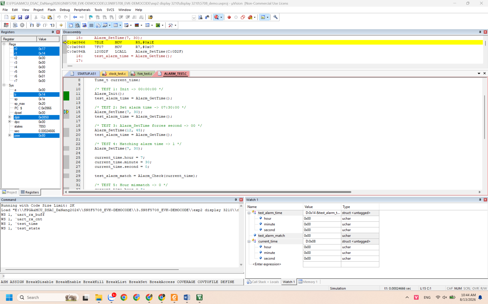
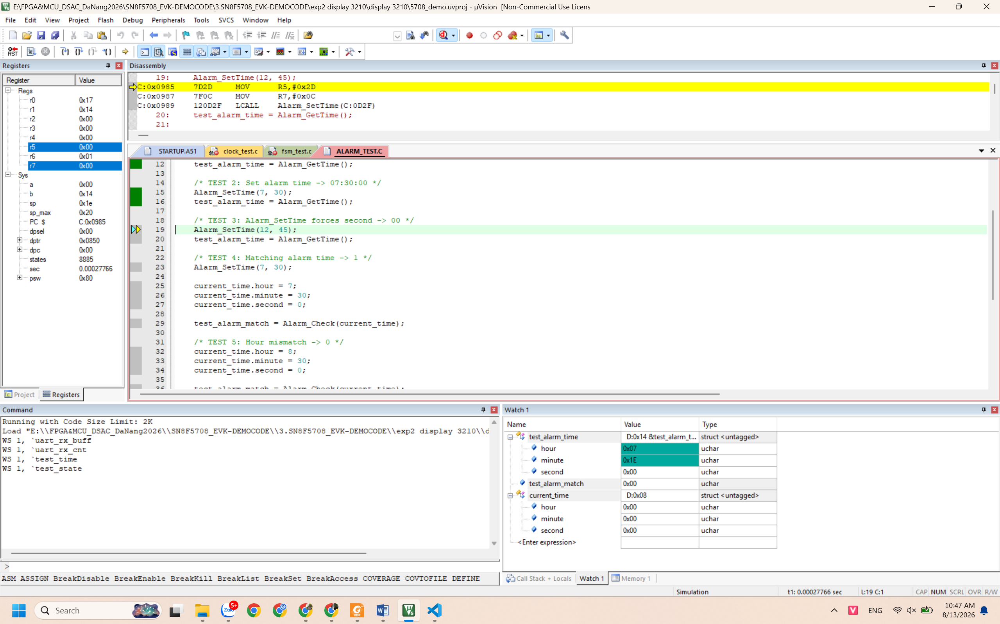
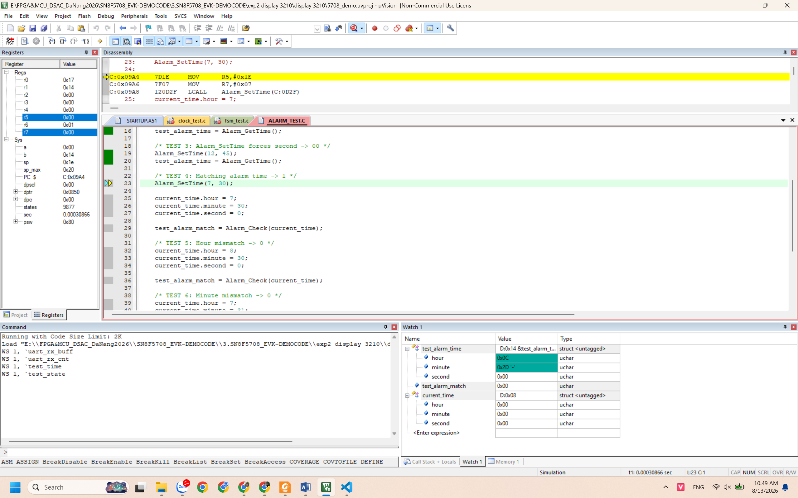
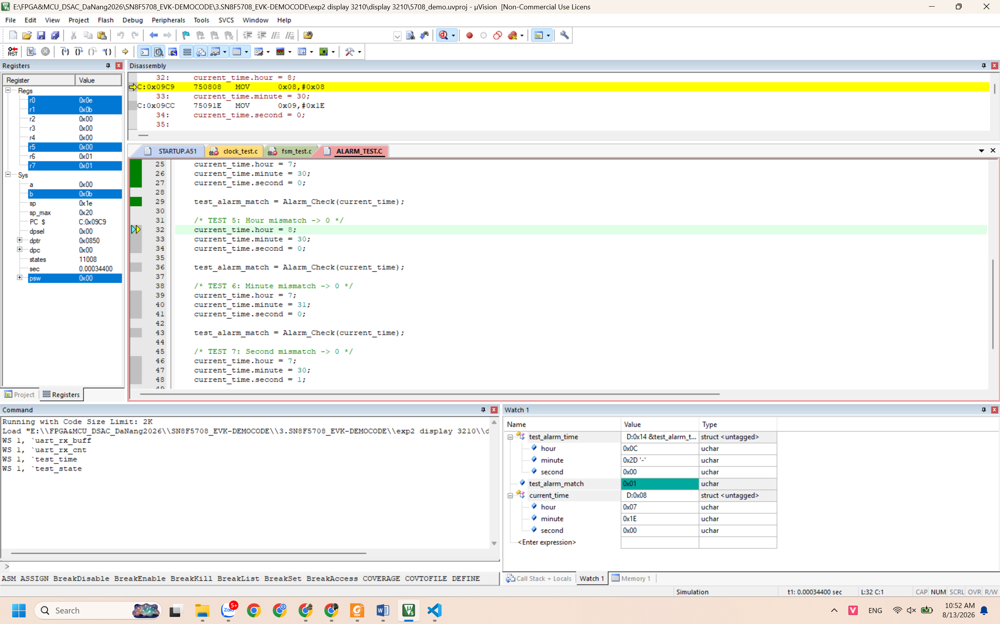
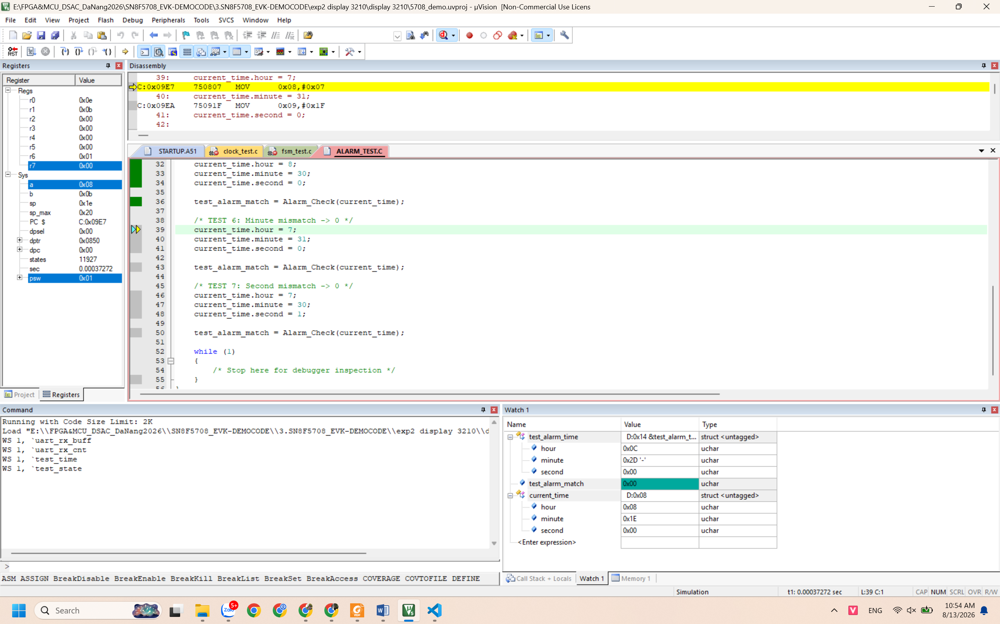
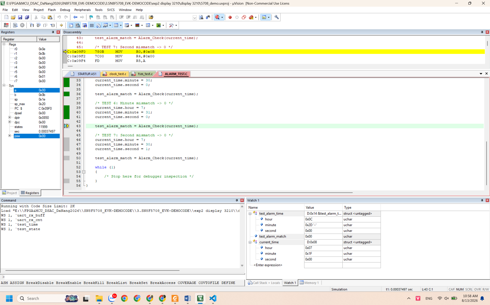
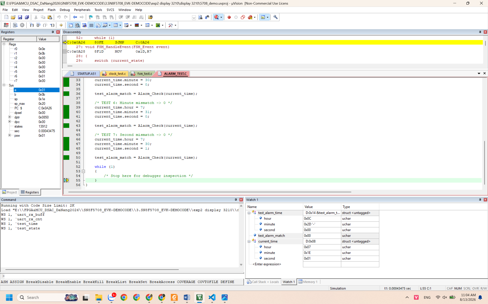

# Alarm Module Testing

## 1. Purpose

This document records the unit testing results for the Alarm module.

The Alarm module is responsible for:

-   Initializing the alarm time.
-   Setting a new alarm time.
-   Returning the currently configured alarm time.
-   Checking whether the current clock time matches the configured alarm
    time.

All tests were executed using the Keil µVision debugger in Simulation
mode.

------------------------------------------------------------------------

## 2. Test Environment

-   MCU: SONiX SN8F5708
-   IDE: Keil µVision
-   Compiler: Keil C51
-   Debug mode: Simulation
-   Test source: `alarm_test.c`
-   Module under test: `alarm.c`

------------------------------------------------------------------------

## 3. Test Results

  ---------------------------------------------------------------------------------------
  Test   Description   Input / Condition         Expected Result   Actual Result Status
  ------ ------------- ------------------------- ----------------- ------------- --------
  TEST 1 Initialize    `Alarm_Init()`            Alarm =           `00:00:00`    PASS
         alarm                                   `00:00:00`                      

  TEST 2 Set alarm     `Alarm_SetTime(7, 30)`    Alarm =           `07:30:00`    PASS
         time                                    `07:30:00`                      

  TEST 3 Verify        `Alarm_SetTime(12, 45)`   Alarm =           `12:45:00`    PASS
         seconds reset                           `12:45:00`                      
         when setting                                                            
         alarm                                                                   

  TEST 4 Matching      Alarm = `07:30:00`,       `Alarm_Check()` = `1`           PASS
         alarm time    Current = `07:30:00`      `1`                             

  TEST 5 Hour mismatch Alarm = `07:30:00`,       `Alarm_Check()` = `0`           PASS
                       Current = `08:30:00`      `0`                             

  TEST 6 Minute        Alarm = `07:30:00`,       `Alarm_Check()` = `0`           PASS
         mismatch      Current = `07:31:00`      `0`                             

  TEST 7 Second        Alarm = `07:30:00`,       `Alarm_Check()` = `0`           PASS
         mismatch      Current = `07:30:01`      `0`                             
  ---------------------------------------------------------------------------------------

------------------------------------------------------------------------

## 4. Test Evidence

### TEST 1 - Alarm Initialization

Expected alarm time:

`00:00:00`

Evidence:

------------------------------------------------------------------------

### TEST 2 - Set Alarm Time

Alarm is configured to:

`07:30:00`

Evidence:

------------------------------------------------------------------------

### TEST 3 - Seconds Reset to Zero

After:

`Alarm_SetTime(12, 45)`

the stored alarm time is:

`12:45:00`

This verifies that the seconds field is reset to `00` when a new alarm
time is configured.

Evidence:

------------------------------------------------------------------------

### TEST 4 - Matching Alarm Time

Configured alarm:

`07:30:00`

Current time:

`07:30:00`

Expected:

`Alarm_Check()` returns `1`.

Evidence:

------------------------------------------------------------------------

### TEST 5 - Hour Mismatch

Configured alarm:

`07:30:00`

Current time:

`08:30:00`

Expected:

`Alarm_Check()` returns `0`.

Evidence:

------------------------------------------------------------------------

### TEST 6 - Minute Mismatch

Configured alarm:

`07:30:00`

Current time:

`07:31:00`

Expected:

`Alarm_Check()` returns `0`.

Evidence:

------------------------------------------------------------------------

### TEST 7 - Second Mismatch

Configured alarm:

`07:30:00`

Current time:

`07:30:01`

Expected:

`Alarm_Check()` returns `0`.

Evidence:

------------------------------------------------------------------------

## 5. Conclusion

All Alarm module test cases passed successfully.

**Result: 7/7 tests PASS**

The tests verify that:

-   Alarm initialization works correctly.
-   Alarm time can be configured correctly.
-   Seconds are reset to zero when setting a new alarm.
-   Exact alarm-time matching is detected correctly.
-   Hour, minute, and second mismatches are rejected correctly.

The Alarm module is ready for integration with the application state
machine and other system modules.
