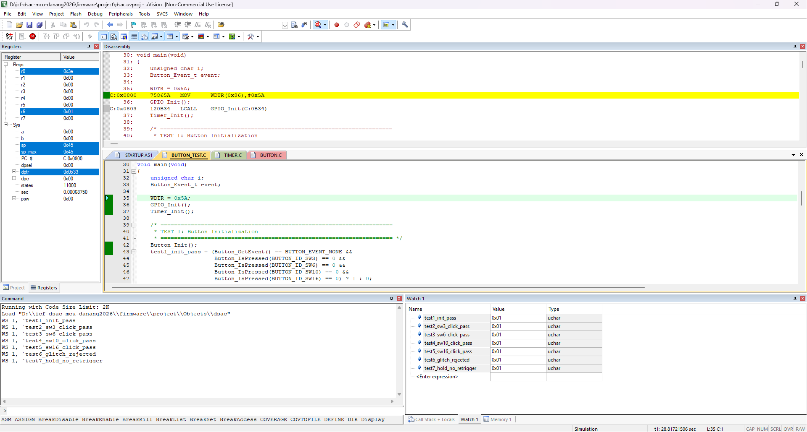

# Button Driver Verification

This directory contains verification documentation and test evidence for the Button Driver module.

## 1. Purpose

The Button Driver is responsible for:
- Reading active-LOW inputs from 4 push buttons: `SW3` (Setup), `SW6` (+), `SW10` (-), `SW16` (Alarm).
- Filtering contact bounce and noise via software debouncing (30ms filter window).
- Generating single click events on falling edges (`BUTTON_EVENT_SW3_CLICK`, `SW6_CLICK`, `SW10_CLICK`, `SW16_CLICK`).
- Buffering events in a non-blocking queue.

Module under test:
- `firmware/drivers/button.c`
- `firmware/drivers/button.h`

Test source:
- `firmware/drivers/button_test.c`

---

## 2. Test Environment

- **Target MCU:** SONiX SN8F5708
- **IDE:** Keil µVision
- **Compiler:** Keil C51
- **Verification Method:** Keil Simulator
- **Debounce Window:** 3 samples × 10ms = 30ms stable interval

---

## 3. Test Results Summary

| Test ID | Test Case | Global Variable | Observed Value | Status |
|---|---|---|:---:|:---:|
| **TEST 1** | Button Initialization | `test1_init_pass` | `0x01` | **PASS** |
| **TEST 2** | SW3 Click Detection (>=30ms) | `test2_sw3_click_pass` | `0x01` | **PASS** |
| **TEST 3** | SW6 Click Detection (>=30ms) | `test3_sw6_click_pass` | `0x01` | **PASS** |
| **TEST 4** | SW10 Click Detection (>=30ms) | `test4_sw10_click_pass` | `0x01` | **PASS** |
| **TEST 5** | SW16 Click Detection (>=30ms) | `test5_sw16_click_pass` | `0x01` | **PASS** |
| **TEST 6** | Glitch / Bounce Rejection (<20ms) | `test6_glitch_rejected` | `0x01` | **PASS** |
| **TEST 7** | Hold Re-trigger Protection | `test7_hold_no_retrigger` | `0x01` | **PASS** |

---

## 4. Test Evidence

### Software Simulation Verification Evidence
The Keil C51 Simulator Watch 1 window confirms all 7/7 test assertions passed:



```text
Name                       Value     Type
---------------------------------------------
test1_init_pass            0x01      uchar
test2_sw3_click_pass       0x01      uchar
test3_sw6_click_pass       0x01      uchar
test4_sw10_click_pass      0x01      uchar
test5_sw16_click_pass      0x01      uchar
test6_glitch_rejected      0x01      uchar
test7_hold_no_retrigger    0x01      uchar
```

### Hardware Verification Status
- **Status:** **Pending hardware validation**
- **Note:** Physical switch debounce on matrix hardware will be verified during full application integration.

---

## 5. Conclusion

- **Software Simulator Verification:** **PASS (7/7 tests - 100%)**
- **Hardware Verification:** Pending hardware validation
