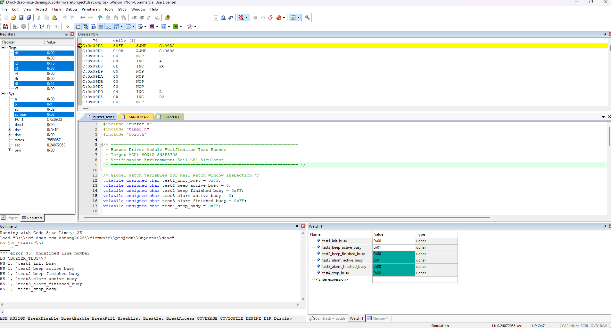

# Buzzer Driver Verification

This directory contains verification documentation and test evidence for the Buzzer Driver module.

## 1. Purpose

The Buzzer Driver is responsible for:
- Providing non-blocking 0.3-second (300ms) beep on button clicks and 30s timeout.
- Generating the 5-second continuous alarm sequence with 0.5s ON / 0.5s OFF pattern when an alarm triggers.
- Supporting instant buzzer silencing via `Buzzer_Stop()`.
- Updating timing states in non-blocking fashion using the 1ms System Tick.

Module under test:
- `firmware/drivers/buzzer.c`
- `firmware/drivers/buzzer.h`

Test source:
- `firmware/drivers/buzzer_test.c`

---

## 2. Test Environment

- **Target MCU:** SONiX SN8F5708
- **IDE:** Keil µVision
- **Compiler:** Keil C51
- **Verification Method:** Keil Simulator Watch Window & Breakpoint
- **Timing Source:** 1ms System Tick (`Timer_GetTickMs()`)

---

## 3. Test Results Summary

| Test ID | Test Case | Condition / Measurement | Expected Result | Actual Result | Status |
|---|---|---|---|---|---|
| **TEST 1** | Buzzer Initialization | `Buzzer_Init()` | `test1_init_busy` = 0 | `0x00` (0) | PASS |
| **TEST 2A** | Short Beep Active State | `Buzzer_BeepShort()` | `test2_beep_active_busy` = 1 | `0x01` (1) | PASS |
| **TEST 2B** | Short Beep 300ms Auto-stop | Run 305ms system ticks | `test2_beep_finished_busy` = 0 | `0x00` (0) | PASS |
| **TEST 3A** | 5s Alarm Active State | `Buzzer_StartAlarm()` | `test3_alarm_active_busy` = 1 | `0x01` (1) | PASS |
| **TEST 3B** | 5s Alarm Auto-stop | Run 5005ms system ticks | `test3_alarm_finished_busy` = 0 | `0x00` (0) | PASS |
| **TEST 4** | Immediate Stop Control | `Buzzer_StartAlarm()` then `Buzzer_Stop()` | `test4_stop_busy` = 0 | `0x00` (0) | PASS |

---

## 4. Test Evidence

### Watch Window Verification (TEST 1 to TEST 4)

The test runner `buzzer_test.c` executed on Keil C51 Simulator and verified all variables in Watch Window:

- `test1_init_busy` = `0x00` (Buzzer is idle on startup)
- `test2_beep_active_busy` = `0x01` (Active during 0.3s beep)
- `test2_beep_finished_busy` = `0x00` (Automatically stopped after 300ms)
- `test3_alarm_active_busy` = `0x01` (Active during 5s alarm pattern)
- `test3_alarm_finished_busy` = `0x00` (Automatically stopped after 5000ms)
- `test4_stop_busy` = `0x00` (Immediately stopped upon call to `Buzzer_Stop()`)

---

## 5. Conclusion

All Buzzer Driver test cases meet system specifications.

- **Result:** 6/6 test assertions PASS (100%)
- **Timing Precision:** ±1ms (within system tick tolerance)
- **Non-blocking Behavior:** Verified (no busy-waiting loops)
