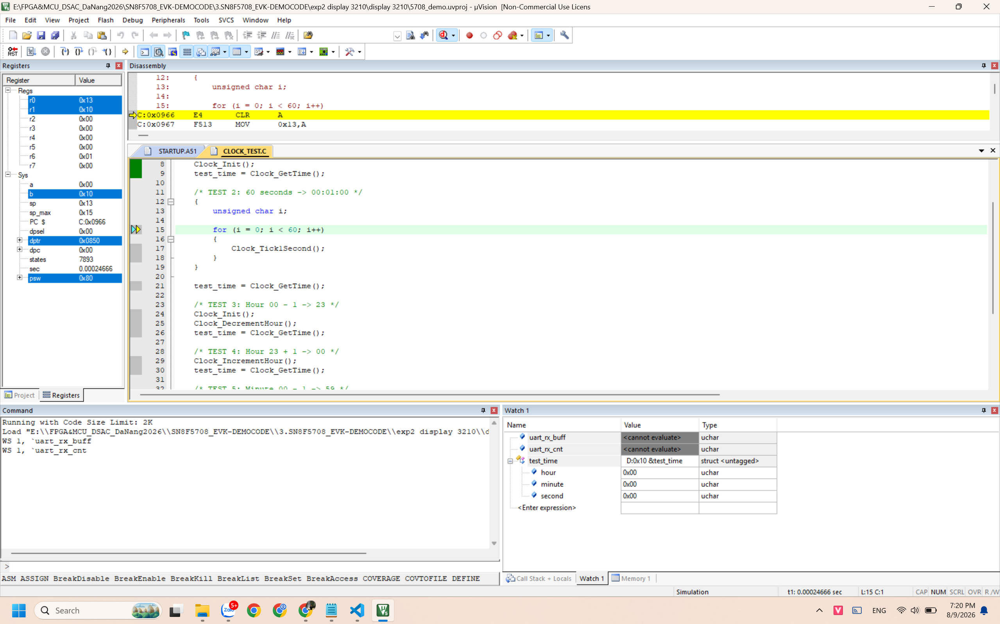
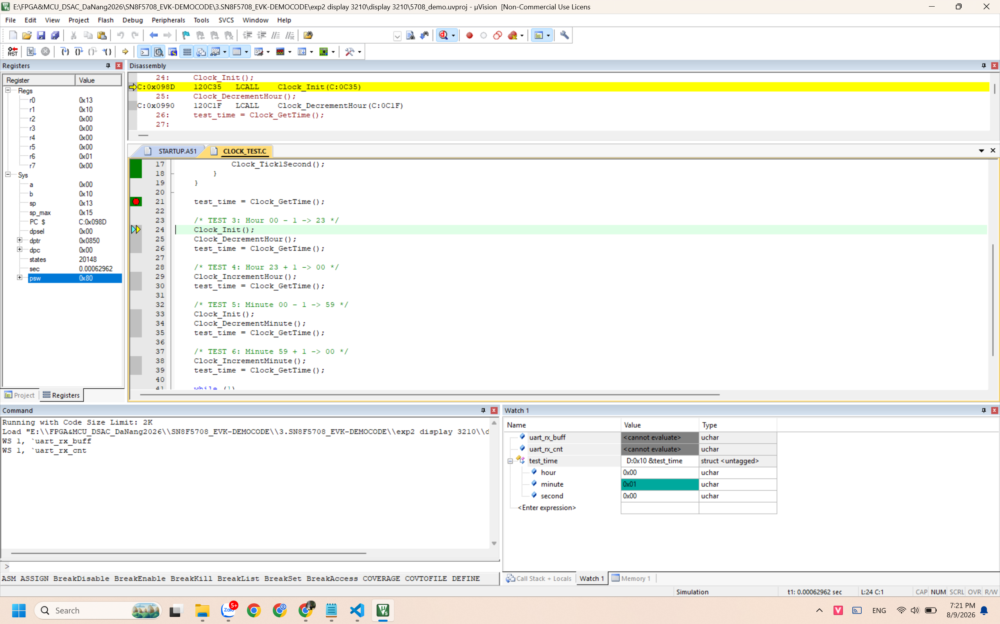
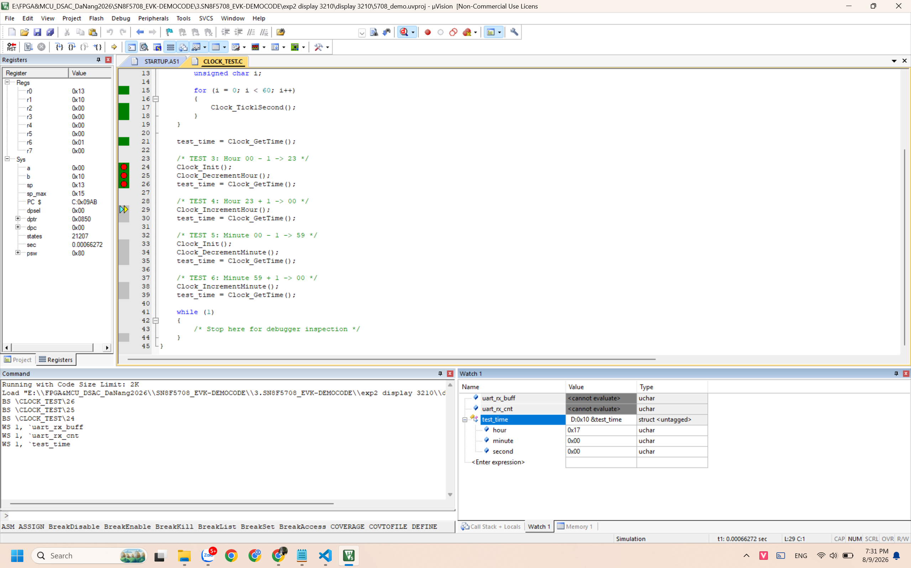
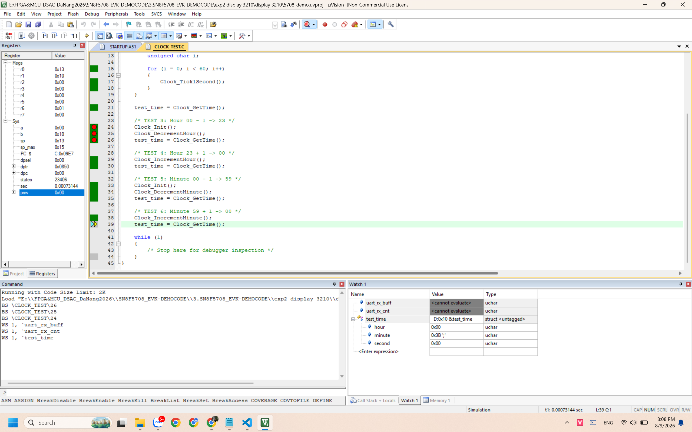
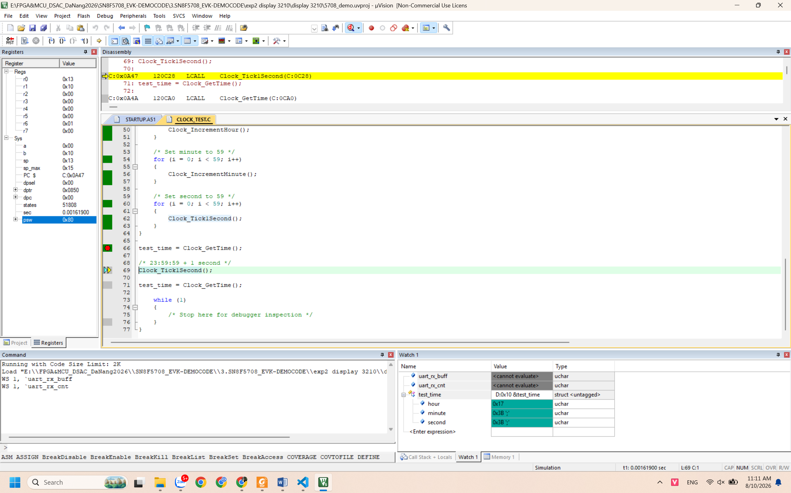
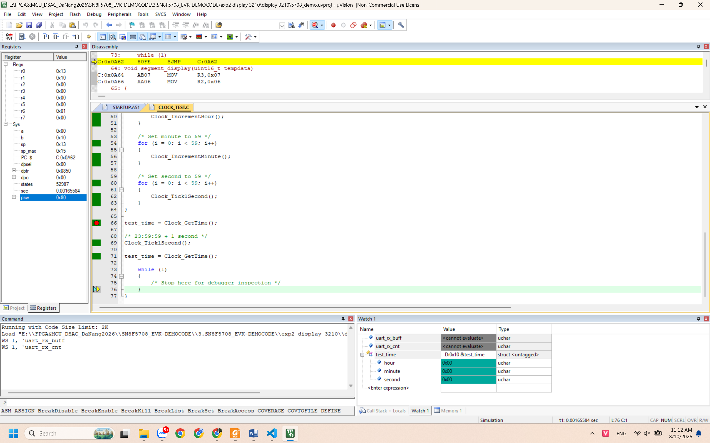

# Clock Core Verification

This directory contains verification evidence for the Clock Core module.

## Test Environment

-   Target MCU: SONiX SN8F5708
-   Compiler: Keil C51
-   IDE: Keil µVision
-   Verification method: Keil Simulator
-   Module under test:
    -   `firmware/app/clock.c`
    -   `firmware/app/clock.h`
-   Test source:
    -   `firmware/app/clock_test.c`

## Test Results

  -----------------------------------------------------------------------------
  ID                Test Case               Expected Result   Result
  ----------------- ----------------------- ----------------- -----------------
  TEST 1            Clock initialization    `00:00:00`        PASS

  TEST 2            60 second rollover      `00:01:00`        PASS

  TEST 3            Hour decrement from 00  `23:00:00`        PASS

  TEST 4            Hour increment from 23  `00:00:00`        PASS

  TEST 5            Minute decrement from   `00:59:00`        PASS
                    00                                        

  TEST 6            Minute increment from   `00:00:00`        PASS
                    59                                        

  TEST 7            Full-day rollover:      `00:00:00`        PASS
                    `23:59:59 + 1 second`                     
  -----------------------------------------------------------------------------

## Test Evidence

### TEST 1 - Clock Initialization

Expected: `00:00:00`

------------------------------------------------------------------------

### TEST 2 - 60 Second Rollover

Expected after 60 seconds: `00:01:00`

------------------------------------------------------------------------

### TEST 3 - Hour Decrement from 00

Expected: `23:00:00`

------------------------------------------------------------------------

### TEST 4 - Hour Increment from 23

Expected: `00:00:00`

------------------------------------------------------------------------

### TEST 5 - Minute Decrement from 00

Expected: `00:59:00`

------------------------------------------------------------------------

### TEST 6 - Minute Increment from 59

Expected: `00:00:00`

------------------------------------------------------------------------

### TEST 7 - Full-Day Rollover

Before tick: `23:59:59`

After one second: `00:00:00`

## Notes

> Keil Watch Window displays `unsigned char` values in hexadecimal.
> Therefore, `0x17 = 23` and `0x3B = 59`.

## Conclusion

All Clock Core test cases passed successfully.

**Result: 7/7 tests PASS**
