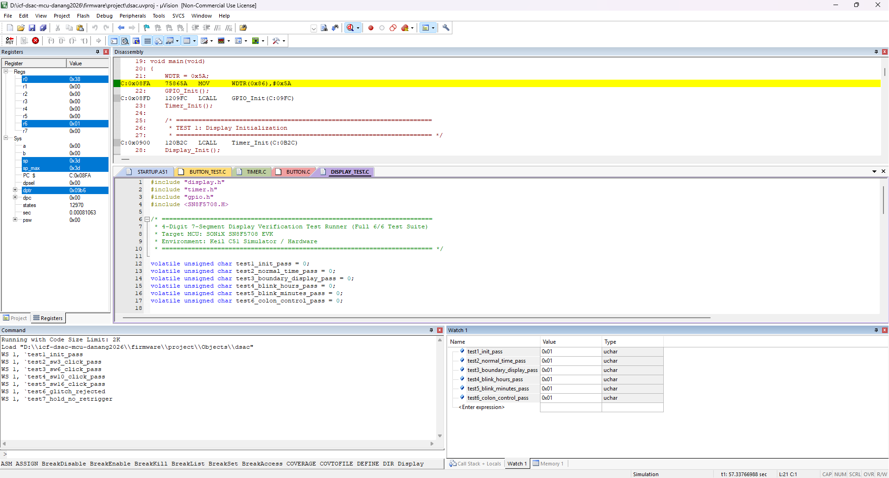

# 4-Digit 7-Segment Display Driver Verification

This directory contains verification documentation and test evidence for the 4-Digit 7-Segment Display Driver module.

## 1. Purpose

The 4-Digit 7-Segment Display Driver is responsible for:
- Decoding BCD digits (0-9) to 7-segment active segment patterns (a, b, c, d, e, f, g, dp).
- Multiplexing 4 digits (`HH.MM`) periodically in Timer ISR with ghosting suppression.
- Supporting middle colon / decimal point control.
- Implementing independent blinking for Hours (`HH`) or Minutes (`MM`) with 1-second period (0.5s ON / 0.5s OFF).

Module under test:
- `firmware/drivers/display.c`
- `firmware/drivers/display.h`

Test source:
- `firmware/drivers/display_test.c`

---

## 2. Test Environment

- **Target MCU:** SONiX SN8F5708
- **IDE:** Keil µVision
- **Compiler:** Keil C51
- **Verification Method:** Keil Simulator / Watch Window
- **Multiplexing Rate:** 2ms per digit (125Hz full frame refresh rate)

---

## 3. Test Results Summary

| Test ID | Test Case | Global Variable | Observed Value | Status |
|---|---|---|:---:|:---:|
| **TEST 1** | Display Initialization | `test1_init_pass` | `0x01` | **PASS** |
| **TEST 2** | Normal Time Display (12:34) | `test2_normal_time_pass` | `0x01` | **PASS** |
| **TEST 3** | Boundary Display (00:00 & 23:59) | `test3_boundary_display_pass` | `0x01` | **PASS** |
| **TEST 4** | Hours Blinking Mode | `test4_blink_hours_pass` | `0x01` | **PASS** |
| **TEST 5** | Minutes Blinking Mode | `test5_blink_minutes_pass` | `0x01` | **PASS** |
| **TEST 6** | Colon / DP Control | `test6_colon_control_pass` | `0x01` | **PASS** |

---

## 4. Test Evidence

### Software Simulation Verification Evidence
The Keil C51 Simulator Watch 1 window confirms all 6/6 test assertions passed:



```text
Name                           Value     Type
-------------------------------------------------
test1_init_pass                0x01      uchar
test2_normal_time_pass         0x01      uchar
test3_boundary_display_pass    0x01      uchar
test4_blink_hours_pass         0x01      uchar
test5_blink_minutes_pass       0x01      uchar
test6_colon_control_pass       0x01      uchar
```

### Hardware Verification Status
- **Status:** **Pending hardware validation**
- **Note:** Multiplexed physical 7-segment display rendering on board will be verified during application integration.

---

## 5. Conclusion

- **Software Simulator Verification:** **PASS (6/6 tests - 100%)**
- **Hardware Verification:** Pending hardware validation
