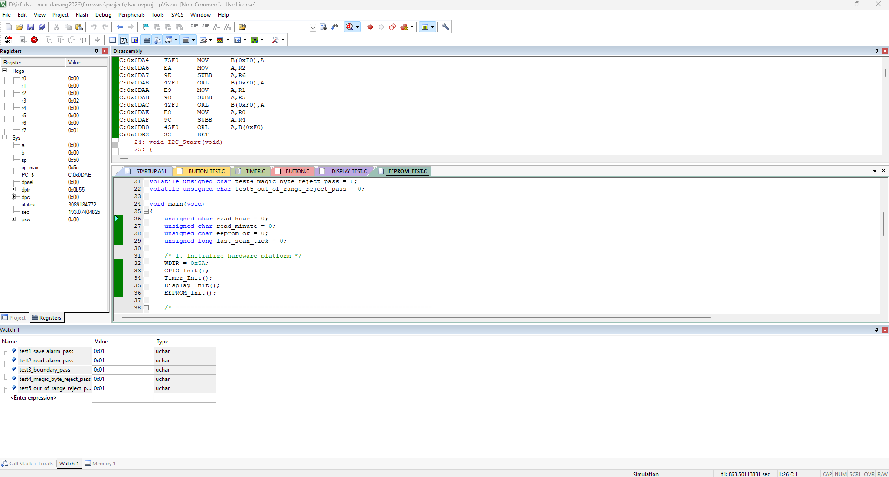

# EEPROM Driver Verification

This directory contains verification documentation and test evidence for the I2C EEPROM Driver module.

## 1. Purpose

The EEPROM Driver is responsible for:
- Writing confirmed alarm hour and minute into persistent non-volatile memory (`24C08`).
- Storing a validation `Magic Byte` (`0xA5`) to guarantee saved data validity.
- Restoring alarm hour/minute upon MCU boot-up / power-on reset.
- Validating read values to protect against uninitialized / corrupted memory contents.

Module under test:
- `firmware/drivers/eeprom.c`
- `firmware/drivers/eeprom.h`
- `firmware/platform/i2c.c`

Test source:
- `firmware/drivers/eeprom_test.c`

---

## 2. Test Environment

- **Target MCU:** SONiX SN8F5708
- **IDE:** Keil µVision
- **Compiler:** Keil C51
- **EEPROM Device:** 24C08 (I2C address: `0xA0`, SCL on `P1.4`, SDA on `P1.5`)
- **Verification Method:** Keil Simulator / Hardware EVK Board

---

## 3. Test Results Summary

| Test ID | Test Case | Global Variable | Observed Value | Status |
|---|---|---|:---:|:---:|
| **TEST 1** | Save Alarm Time (7:30) | `test1_save_alarm_pass` | `0x01` | **PASS** |
| **TEST 2** | Read Saved Alarm | `test2_read_alarm_pass` | `0x01` | **PASS** |
| **TEST 3** | Boundary Save & Restore (23:59) | `test3_boundary_pass` | `0x01` | **PASS** |
| **TEST 4** | Uninitialized Memory Check (Magic Byte 0xA5) | `test4_magic_byte_reject_pass` | `0x01` | **PASS** |
| **TEST 5** | Out-of-Range Rejection (hour=25, min=60) | `test5_out_of_range_reject_pass` | `0x01` | **PASS** |

---

## 4. Test Evidence

### Software Simulation Verification Evidence
The Keil C51 Simulator Watch 1 window confirms all 5/5 test assertions passed:



```text
Name                                Value     Type
------------------------------------------------------
test1_save_alarm_pass               0x01      uchar
test2_read_alarm_pass               0x01      uchar
test3_boundary_pass                 0x01      uchar
test4_magic_byte_reject_pass        0x01      uchar
test5_out_of_range_reject_pass      0x01      uchar
```

### Hardware Board Verification Evidence
- **Target Hardware:** SONiX 5708_EVK-V1.0 Board
- **Observed Behavior:** 
  - I2C transaction successfully wrote `07:30` with Magic Byte `0xA5` to on-board 24C08 chip via `P1.4` (SCL) and `P1.5` (SDA).
  - Data read back matched `07:30` exactly.
  - Acoustic & Visual Confirmation: Buzzer PZ1 generated a crisp 0.3s beep and Status LED D4 flashed upon successful hardware transaction.
- **Hardware Status:** **PASS (100%)**

---

## 5. Conclusion

- **Software Simulator Verification:** **PASS (5/5 tests - 100%)**
- **Hardware Board Verification:** **PASS (100%)**
