# Application FSM Verification

This directory contains verification evidence for the Application FSM
module.

## Test Environment

-   Target MCU: SONiX SN8F5708
-   Compiler: Keil C51
-   IDE: Keil µVision
-   Verification method: Keil Simulator
-   Module under test:
    -   `firmware/app/fsm.c`
    -   `firmware/app/fsm.h`
-   Test source:
    -   `firmware/app/fsm_test.c`

## Test Results

  ---------------------------------------------------------------------------------
  ID                Test Case            Expected Result          Result
  ----------------- -------------------- ------------------------ -----------------
  TEST 1            FSM initialization   `FSM_NORMAL`             PASS

  TEST 2            NORMAL + SW3         `FSM_SET_TIME_HOUR`      PASS

  TEST 3            SET_TIME_HOUR + SW6  Hour +1, state remains   PASS
                                         `FSM_SET_TIME_HOUR`      

  TEST 4            SET_TIME_HOUR + SW10 Hour -1, state remains   PASS
                                         `FSM_SET_TIME_HOUR`      

  TEST 5            SET_TIME_HOUR + SW3  `FSM_SET_TIME_MINUTE`    PASS

  TEST 6            SET_TIME_MINUTE +    Minute +1, state remains PASS
                    SW6                  `FSM_SET_TIME_MINUTE`    

  TEST 7            SET_TIME_MINUTE +    Minute -1, state remains PASS
                    SW10                 `FSM_SET_TIME_MINUTE`    

  TEST 8            SET_TIME_MINUTE +    `FSM_NORMAL`             PASS
                    SW3                                           

  TEST 9            NORMAL + SW16        `FSM_SET_ALARM_HOUR`     PASS

  TEST 10           SET_ALARM_HOUR +     `FSM_SET_ALARM_MINUTE`   PASS
                    SW16                                          

  TEST 11           SET_ALARM_MINUTE +   `FSM_NORMAL`             PASS
                    SW16                                          

  TEST 12           Timeout from         `FSM_NORMAL`             PASS
                    SET_TIME_HOUR                                 

  TEST 13           Timeout from         `FSM_NORMAL`             PASS
                    SET_TIME_MINUTE                               

  TEST 14           Timeout from         `FSM_NORMAL`             PASS
                    SET_ALARM_HOUR                                

  TEST 15           Timeout from         `FSM_NORMAL`             PASS
                    SET_ALARM_MINUTE                              

  TEST 16           Undefined event:     State remains            PASS
                    NORMAL + SW6         `FSM_NORMAL`             

  TEST 17           Undefined event:     State remains            PASS
                    NORMAL + SW10        `FSM_NORMAL`             
  ---------------------------------------------------------------------------------

## Test Evidence

### TEST 1 - FSM Initialization

Expected: `FSM_NORMAL`

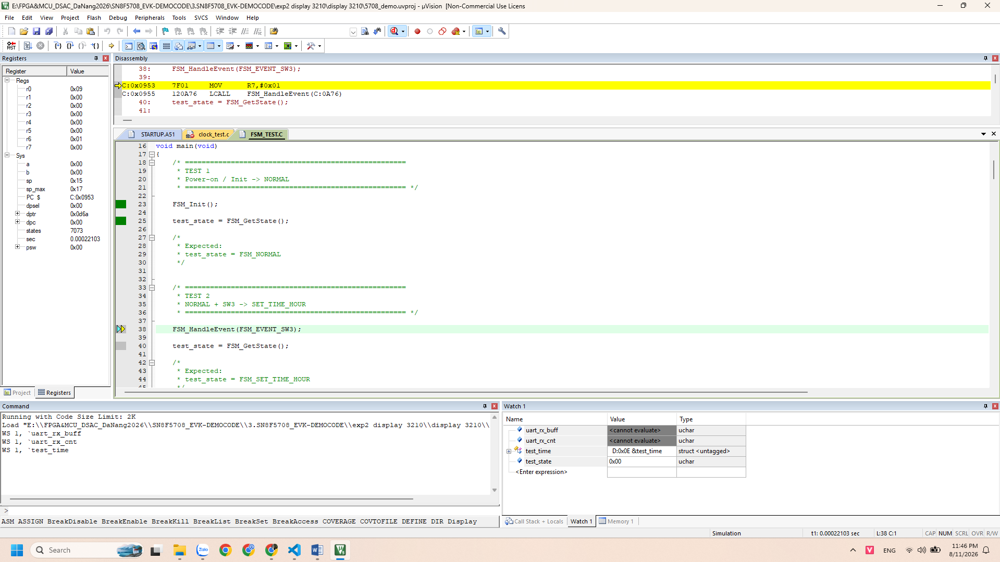

------------------------------------------------------------------------

### TEST 2 - NORMAL to SET_TIME_HOUR

Expected: `FSM_SET_TIME_HOUR`

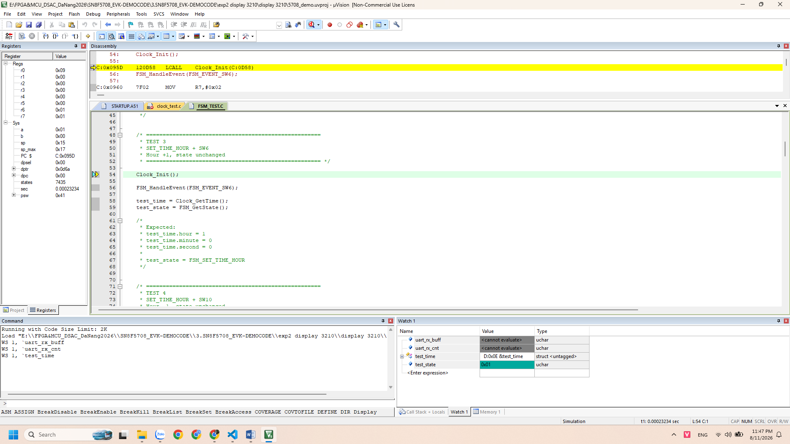

------------------------------------------------------------------------

### TEST 3 - Increment Hour with SW6

Expected: Hour +1; state remains `FSM_SET_TIME_HOUR`.

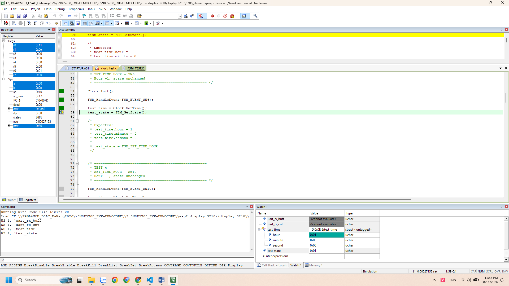

------------------------------------------------------------------------

### TEST 4 - Decrement Hour with SW10

Expected: Hour -1; state remains `FSM_SET_TIME_HOUR`.

------------------------------------------------------------------------

### TEST 5 - SET_TIME_HOUR to SET_TIME_MINUTE

Expected: `FSM_SET_TIME_MINUTE`

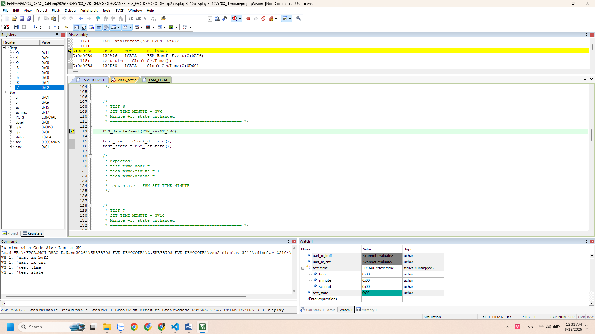

------------------------------------------------------------------------

### TEST 6 - Increment Minute with SW6

Expected: Minute +1; state remains `FSM_SET_TIME_MINUTE`.

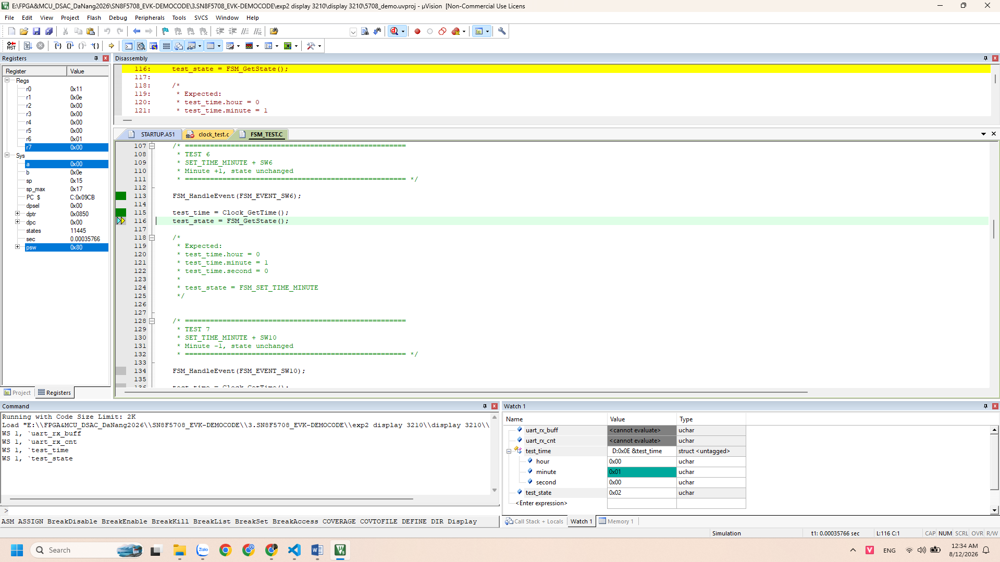

------------------------------------------------------------------------

### TEST 7 - Decrement Minute with SW10

Expected: Minute -1; state remains `FSM_SET_TIME_MINUTE`.

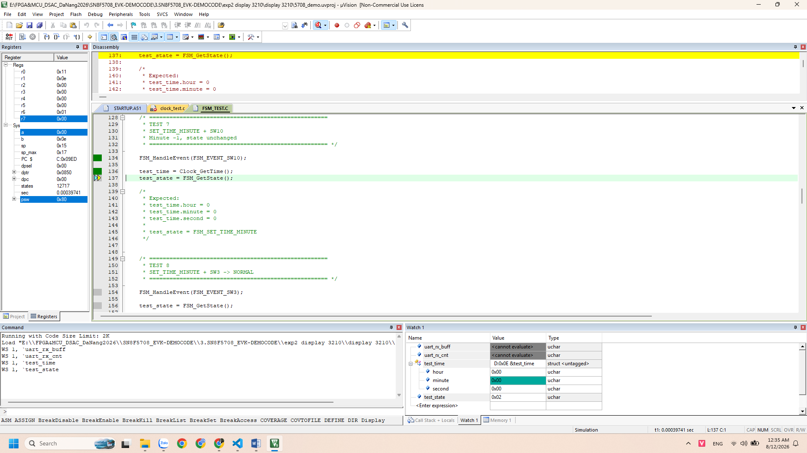

------------------------------------------------------------------------

### TEST 8 - SET_TIME_MINUTE to NORMAL

Expected: `FSM_NORMAL`

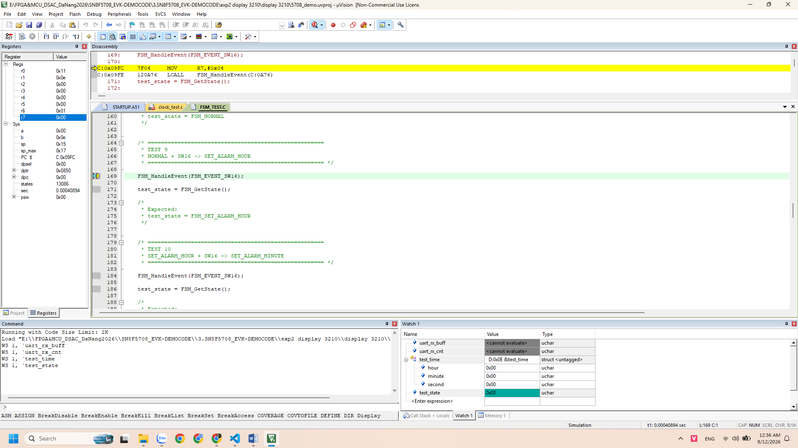

------------------------------------------------------------------------

### TEST 9 - NORMAL to SET_ALARM_HOUR

Expected: `FSM_SET_ALARM_HOUR`

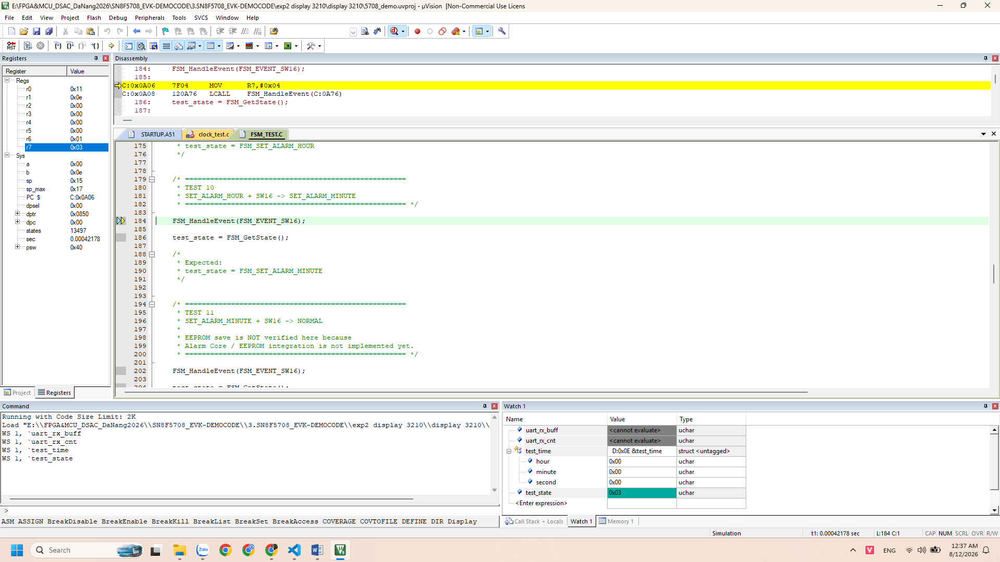

------------------------------------------------------------------------

### TEST 10 - SET_ALARM_HOUR to SET_ALARM_MINUTE

Expected: `FSM_SET_ALARM_MINUTE`

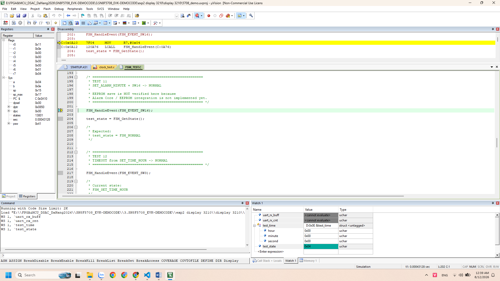

------------------------------------------------------------------------

### TEST 11 - SET_ALARM_MINUTE to NORMAL

Expected: `FSM_NORMAL`

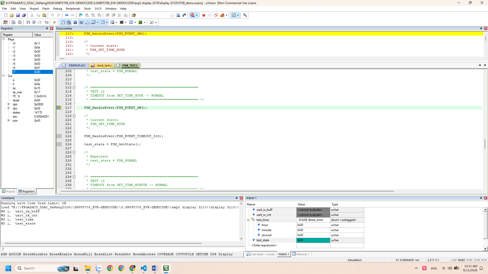

------------------------------------------------------------------------

### TEST 12 - Timeout from SET_TIME_HOUR

Expected: `FSM_NORMAL`

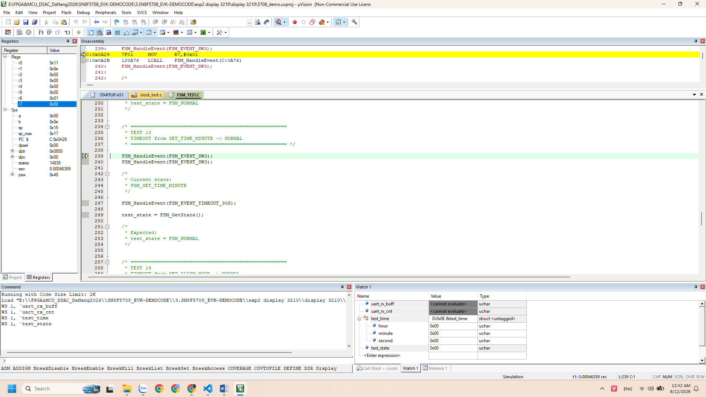

------------------------------------------------------------------------

### TEST 13 - Timeout from SET_TIME_MINUTE

Expected: `FSM_NORMAL`

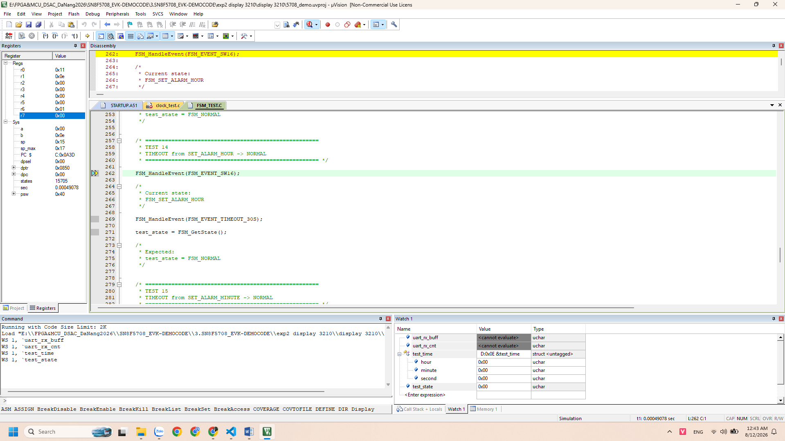

------------------------------------------------------------------------

### TEST 14 - Timeout from SET_ALARM_HOUR

Expected: `FSM_NORMAL`

------------------------------------------------------------------------

### TEST 15 - Timeout from SET_ALARM_MINUTE

Expected: `FSM_NORMAL`

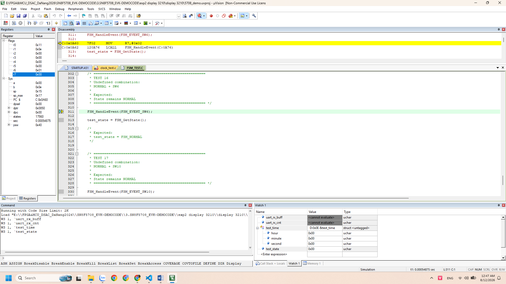

------------------------------------------------------------------------

### TEST 16 - Undefined NORMAL + SW6

Expected: State remains `FSM_NORMAL`.

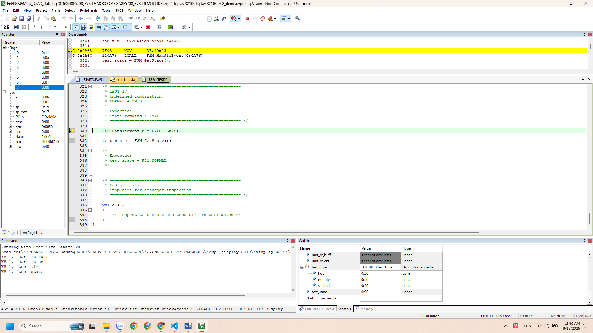

------------------------------------------------------------------------

### TEST 17 - Undefined NORMAL + SW10

Expected: State remains `FSM_NORMAL`.

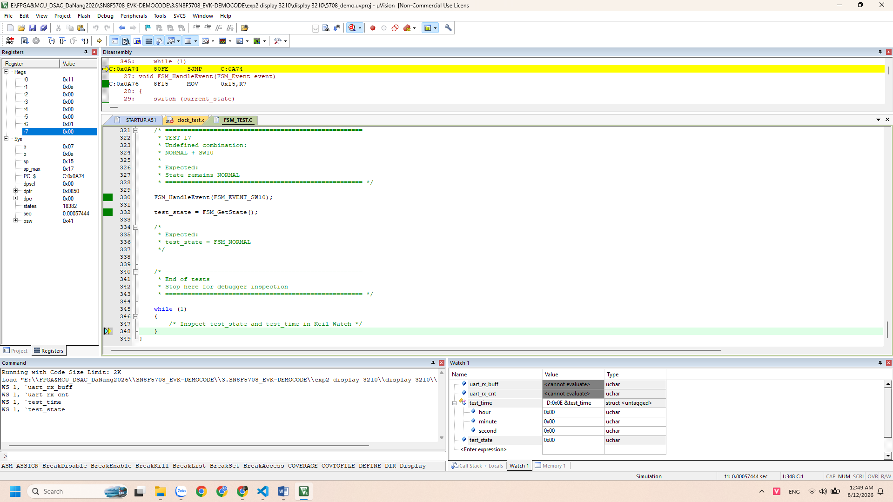

## Notes

-   FSM state transitions were verified using `test_state` in the Keil
    Watch Window.
-   Clock adjustment behavior was verified using `test_time`.
-   Alarm Core and EEPROM integration are not verified by this FSM unit
    test.
-   Hardware button integration will be verified during system
    integration.

## Conclusion

All Application FSM test cases passed successfully.

**Result: 17/17 tests PASS**
