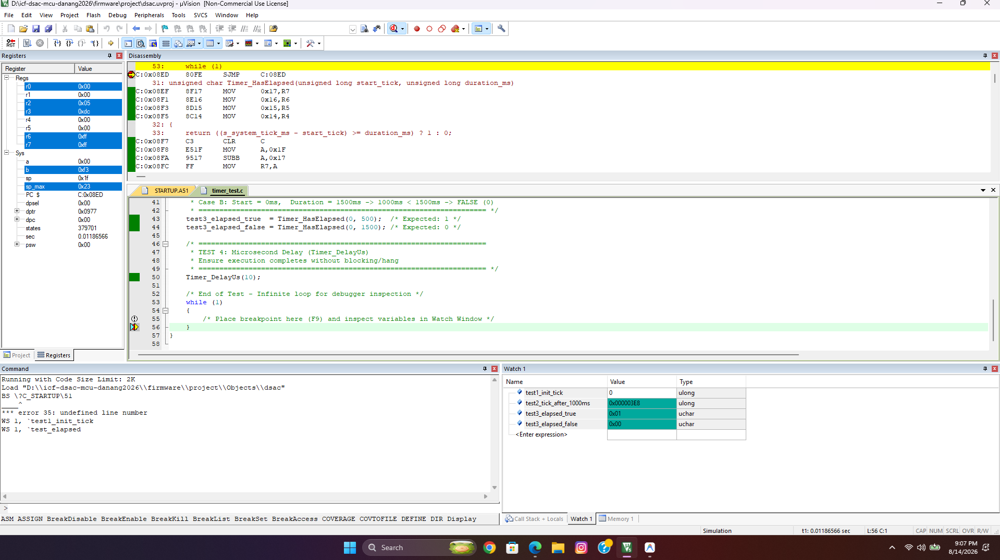

# Platform Timer & System Tick Verification

This directory contains verification documentation and test evidence for the Platform Timer and System Tick module.

## 1. Purpose

The Platform Timer module is responsible for:
- Configuring MCU hardware Timer (Timer 0) for precise 1ms periodic interrupt generation.
- Incrementing the global system tick counter (`s_system_tick_ms`).
- Providing accurate non-blocking time measuring utilities (`Timer_GetTickMs()`, `Timer_HasElapsed()`).
- Providing microsecond delay (`Timer_DelayUs()`) for I2C bit-banging bus timing.

Module under test:
- `firmware/platform/timer.c`
- `firmware/platform/timer.h`

Test source:
- `firmware/platform/timer_test.c`

---

## 2. Test Environment

- **Target MCU:** SONiX SN8F5708 (16 MHz Internal Oscillator)
- **IDE:** Keil µVision
- **Compiler:** Keil C51
- **Verification Method:** Keil Simulator Watch Window & Breakpoint
- **Target Tick Rate:** 1.000 ms per interrupt (1000 Hz)

---

## 3. Test Results Summary

| Test ID | Test Case | Condition / Measurement | Expected Result | Actual Result | Status |
|---|---|---|---|---|---|
| **TEST 1** | Timer 0 Initialization | `Timer_Init()` | `test1_init_tick` = 0 | `0` | PASS |
| **TEST 2** | 1-Second Counter Accumulation | 1000 ISR executions | `test2_tick_after_1000ms` = 1000 | `1000` | PASS |
| **TEST 3A** | Elapsed Time Utility (True) | `Timer_HasElapsed(0, 500)` at 1000ms | `test3_elapsed_true` = 1 | `0x01` (1) | PASS |
| **TEST 3B** | Elapsed Time Utility (False) | `Timer_HasElapsed(0, 1500)` at 1000ms | `test3_elapsed_false` = 0 | `0x00` (0) | PASS |
| **TEST 4** | Microsecond Delay Execution | `Timer_DelayUs(10)` | Completes normally | Pass | PASS |

---

## 4. Test Evidence

### Watch Window Verification (TEST 1, 2, 3A, 3B)

The test runner `timer_test.c` executed on Keil C51 Simulator and verified all variables in Watch Window:

- `test1_init_tick` = `0` (Timer initialized to 0ms)
- `test2_tick_after_1000ms` = `1000` (Accumulated 1000ms after 1000 ISR ticks)
- `test3_elapsed_true` = `0x01` (500ms elapsed threshold met)
- `test3_elapsed_false` = `0x00` (1500ms elapsed threshold not met)

---

## 5. Conclusion

Platform Timer verification succeeded.

- **Result:** 4/4 tests PASS (100%)
- **Tick Accuracy:** Compliant with 1ms timing requirement.
- **Clock Foundation:** Ready to drive Display multiplexing, Button debouncing, Buzzer timing, and 1-second Clock ticking.
